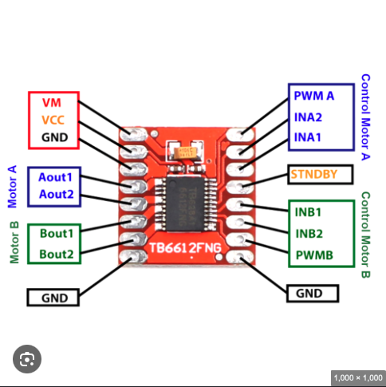
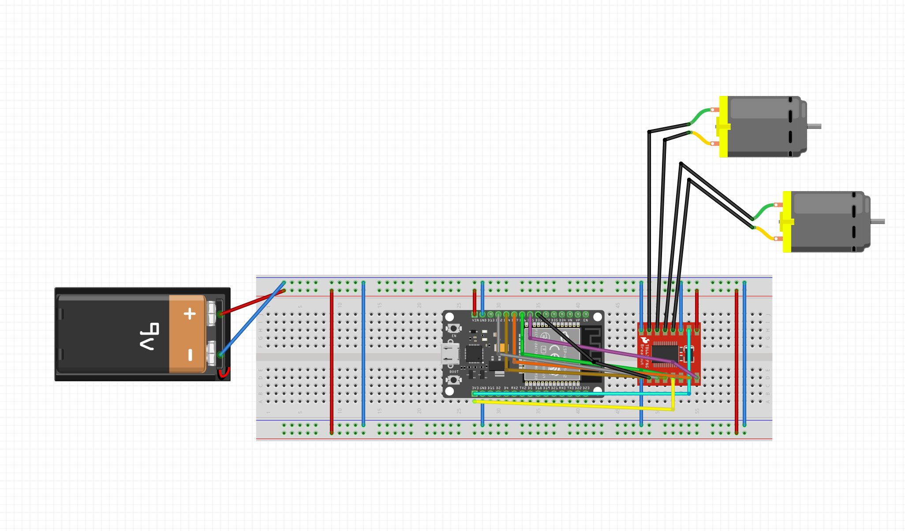
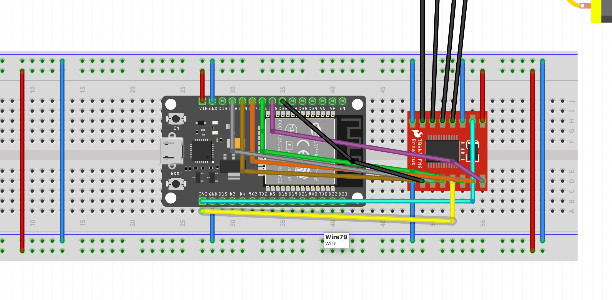

# Driver de Motores: TB6612FNG

> **Componente:** Driver dual de motores DC con puente H
> **Fabricante:** Toshiba (chip), SparkFun/genéricos (módulo breakout)
> **Función en el robot:** Controlar dirección y velocidad de los dos motores N20

---

## 📑 Tabla de contenidos

- [¿Por qué este componente?](#por-qué-este-componente)
- [¿Qué es y cómo funciona?](#qué-es-y-cómo-funciona)
- [Especificaciones técnicas](#especificaciones-técnicas)
- [Pinout y conexiones](#pinout-y-conexiones)
- [Lógica de control](#lógica-de-control)
- [Sistema de doble alimentación](#sistema-de-doble-alimentación)
- [Comparación con alternativas](#comparación-con-alternativas)
- [Imágenes y referencias](#imágenes-y-referencias)

---

## ¿Por qué este componente?

El ESP32 es un microcontrolador de bajo voltaje (3.3V) y baja corriente (~40 mA por pin). No puede alimentar directamente motores DC, que requieren:

- Voltaje mayor (típicamente 6V–12V)
- Corrientes de 200–500 mA en operación normal, con picos al arrancar
- Capacidad de invertir polaridad para cambiar dirección de giro

Si se conectaran los motores directamente al ESP32:

- Se quemaría el microcontrolador al instante
- Los motores apenas se moverían (poca corriente, bajo voltaje)
- No se podría controlar la dirección de giro

El **TB6612FNG** resuelve esto actuando como intermediario entre el ESP32 y los motores. Recibe señales lógicas de baja potencia y entrega alta corriente a los motores desde una fuente separada (la batería LiPo).

### Razones específicas de elección

1. **Alta eficiencia (~90%)** gracias al uso de MOSFETs en lugar de transistores BJT
2. **Baja caída de voltaje (0.5V)** — los motores reciben casi todo el voltaje de la batería
3. **Bajo calor generado** — no necesita disipador para corrientes pequeñas (motores N20)
4. **Tamaño compacto** — ideal para robots pequeños
5. **Dual integrado** — un solo chip controla los dos motores del robot diferencial

---

## ¿Qué es y cómo funciona?

El TB6612FNG es un driver de motores DC con **dos puentes H** integrados, uno por cada motor.

### El concepto del puente H

Un puente H es un circuito con cuatro interruptores (en este caso, MOSFETs) dispuestos alrededor del motor:

```
         VCC (motor)
              │
         ┌────┴────┐
         │         │
         S1       S3
         │         │
         ├─[Motor]─┤
         │         │
         S2       S4
         │         │
         └────┬────┘
              │
             GND
```

Al cerrar diferentes combinaciones de interruptores, se controla el flujo de corriente a través del motor:

| Acción | Interruptores cerrados | Efecto |
|---|---|---|
| Adelante | S1 + S4 | Corriente fluye izquierda → derecha |
| Atrás | S2 + S3 | Corriente fluye derecha → izquierda |
| Freno activo | S1 + S3 (o S2 + S4) | Cortocircuito controlado del motor |
| Coast (libre) | Ninguno | Motor gira por inercia |

El TB6612FNG implementa esta lógica internamente con MOSFETs, controlados desde fuera mediante señales lógicas simples (HIGH/LOW).

### Control de velocidad con PWM

Además de la dirección, el TB6612FNG permite controlar la velocidad mediante **PWM** (Pulse Width Modulation). En lugar de aplicar 7.4V constantes, aplica pulsos rápidos cuyo "ancho" determina la potencia promedio:

- PWM al 100% → motor a velocidad máxima
- PWM al 50% → motor a media velocidad
- PWM al 0% → motor detenido

El ESP32 genera la señal PWM por hardware usando su periférico **LEDC**, sin gastar ciclos de CPU.

---

## Especificaciones técnicas

| Parámetro | Valor |
|---|---|
| Voltaje de motores (VM) | 2.5V – 13.5V |
| Voltaje de lógica (VCC) | 2.7V – 5.5V |
| Corriente continua por canal | 1.2 A |
| Corriente pico por canal | 3.2 A |
| Frecuencia PWM máxima | 100 kHz |
| Canales de motor | 2 (Motor A y Motor B) |
| Tecnología interna | MOSFET (mayor eficiencia que BJT) |
| Protecciones incluidas | Térmica, bajo voltaje, sobre-corriente |

---

## Pinout y conexiones

El módulo TB6612FNG tiene tres grupos de pines:

### Grupo 1: Alimentación

| Pin | Función | Conexión en el robot |
|---|---|---|
| **VM** | Voltaje para motores | Batería LiPo 2S (+7.4V) directo |
| **VCC** | Voltaje para lógica del chip | 5V regulado desde Mini-360 |
| **GND** | Tierra | GND común con ESP32 y batería |

> ⚠️ VM y VCC son independientes. Esto permite alimentar motores con alto voltaje mientras la lógica del chip opera con voltaje bajo y estable.

### Grupo 2: Señales de control desde el ESP32

| Pin TB6612FNG | Pin ESP32 | Función |
|---|---|---|
| STBY | GPIO 13 | Standby — HIGH activa el chip, LOW lo apaga |
| PWMA | GPIO 25 | PWM Motor A — controla velocidad (0–255) |
| AIN1 | GPIO 26 | Dirección Motor A (bit 1) |
| AIN2 | GPIO 27 | Dirección Motor A (bit 2) |
| PWMB | GPIO 33 | PWM Motor B — controla velocidad (0–255) |
| BIN1 | GPIO 14 | Dirección Motor B (bit 1) |
| BIN2 | GPIO 12 | Dirección Motor B (bit 2) |

### Grupo 3: Salidas a motores

| Pin TB6612FNG | Conexión |
|---|---|
| AO1 | Motor A — cable (+) |
| AO2 | Motor A — cable (−) |
| BO1 | Motor B — cable (+) |
| BO2 | Motor B — cable (−) |

> 💡 La polaridad del motor (qué cable va a AO1 y cuál a AO2) determina qué dirección se considera "adelante". Si el motor gira al revés, basta con invertir AO1↔AO2 o cambiar la lógica en el código.

---

## Lógica de control

Para cada motor, la combinación de IN1, IN2 y PWM determina su comportamiento:

| IN1 | IN2 | PWM | Estado del motor |
|---|---|---|---|
| HIGH | LOW | 0–255 | Adelante (velocidad según PWM) |
| LOW | HIGH | 0–255 | Atrás (velocidad según PWM) |
| HIGH | HIGH | cualquiera | Freno activo (short brake) |
| LOW | LOW | cualquiera | Coast (motor libre, gira por inercia) |
| cualquiera | cualquiera | 0 | Detenido |

### Ejemplo de código

```cpp
// Motor A hacia adelante a velocidad media
digitalWrite(AIN1, HIGH);
digitalWrite(AIN2, LOW);
ledcWrite(canalPWMA, 128);   // 128/255 ≈ 50%

// Motor A hacia atrás a velocidad máxima
digitalWrite(AIN1, LOW);
digitalWrite(AIN2, HIGH);
ledcWrite(canalPWMA, 255);

// Frenar Motor A
digitalWrite(AIN1, HIGH);
digitalWrite(AIN2, HIGH);
```

### Sobre el pin STBY

El pin **STBY (Standby)** actúa como interruptor maestro del chip:

- **STBY = HIGH** → Chip activo, los motores responden a las señales
- **STBY = LOW** → Chip en bajo consumo, los motores no se mueven sin importar las señales

En el firmware, STBY se pone en HIGH una vez al iniciar (`setup()`). Olvidarlo es un error común que causa que el robot no se mueva aunque el código parezca correcto.

---

## Sistema de doble alimentación

```
                    Batería LiPo 2S (7.4V)
                           │
                           ├──→ VM (motores reciben 7.4V)
                           │
                    Mini-360 (regulador DC-DC)
                           │
                           ├──→ 5V → ESP32 VIN
                           │
                           ├──→ 5V → TB6612FNG VCC (lógica)
                           │
                           └──→ GND común a todo el sistema
```

### ¿Por qué dos fuentes separadas?

1. Los **motores** consumen corrientes grandes y generan picos al arrancar
2. La **lógica** del ESP32 y del chip TB6612FNG necesita voltaje estable
3. Si todo compartiera el mismo riel, los picos de corriente del motor causarían caídas de voltaje que podrían reiniciar el ESP32 o introducir errores

Esta separación es **estándar en cualquier robot móvil bien diseñado** y aumenta significativamente la fiabilidad del sistema.

---

## Comparación con alternativas

| Característica | TB6612FNG | L298N | DRV8833 |
|---|---|---|---|
| Tecnología interna | MOSFET | BJT (Darlington) | MOSFET |
| Eficiencia | ~90% | ~60% | ~90% |
| Caída de voltaje | 0.5V | 2.0V+ | 0.5V |
| Corriente continua | 1.2 A | 2.0 A | 1.5 A |
| Calor generado | Bajo | Alto (necesita disipador) | Bajo |
| Tamaño del módulo | Pequeño | Grande | Muy pequeño |
| Costo aproximado | $3 USD | $2 USD | $3 USD |
| Recomendado para | Robots pequeños/medianos | Motores grandes | Robots muy compactos |

### ¿Por qué TB6612FNG y no L298N?

El L298N es más común en kits para principiantes, pero tiene desventajas serias para este proyecto:

- Pierde 2V o más como calor → la batería se descarga más rápido
- Requiere disipador térmico → más volumen
- Menor eficiencia → menor autonomía del robot

El TB6612FNG aprovecha mejor cada miliamperio de la batería LiPo, lo cual es crítico en un robot pequeño con batería limitada.

---

## Imágenes y referencias

### Fotos del componente

<!-- TODO: Agregar fotos -->

### Diagrama de conexiones en el robot

<!-- TODO: Exportar diagrama de Fritzing aquí -->



### Documentos de referencia

- [Datasheet oficial Toshiba TB6612FNG](https://www.sparkfun.com/datasheets/Robotics/TB6612FNG.pdf)
- [Hookup Guide de SparkFun](https://learn.sparkfun.com/tutorials/tb6612fng-hookup-guide)
- [Librería oficial SparkFun TB6612FNG (Arduino)](https://github.com/sparkfun/SparkFun_TB6612FNG_Arduino_Library)

---

## Notas de implementación

### Estado actual en el proyecto

- [x] Componente seleccionado y justificado
- [x] Pinout definido para integración con ESP32
- [x] Código base de control implementado (`src/main.cpp`)
- [x] Lógica validada en simulación (Wokwi)
- [x] Diagrama de cableado en Fritzing
- [ ] Pruebas con hardware real
- [ ] Ajuste fino de PWM según comportamiento de los motores N20

### Próximos pasos

1. Simular conexión en proteus o similar
2. Conectar físicamente sobre protoboard y validar lógica
3. Integrar con encoders para control de velocidad en lazo cerrado
4. Caracterizar respuesta motor → PWM real

---

*Documento mantenido por: Francisco David Zárate Vásquez*
*Última actualización: 16 de mayo 2026*